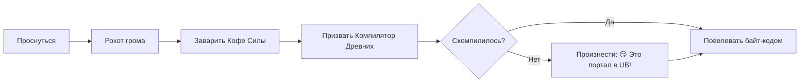

# 🧠⚡ **C++ SUPREME OVERLORD**

---

## 🧙‍♂️ Кто я?

Я — программист C++, который не пишет ОС по утрам. ОС пишет ***меня***.  

Мой компилятор включает компьютер, а не наоборот.  

Однажды я запустил программу настолько быстро, что она выполнилась в прошлом.

> "Undefined behavior — это не ошибка. Это приглашение к творчеству."

---

## 🚀 Способности

* 🧩 Пишу шаблоны C++ такие сложные, что ChatGPT берёт отпуск
* 🔥 Оптимизирую код дважды: руками и взглядом
* 🛡 Дебажу ядро без перезагрузки (и иногда без компьютера)
* 💾 Пишу драйверы для устройств будущего
* ⚡ Использую `constexpr` так, что время компиляции боится меня
* 🌀 Создаю `std::thread`, которые сами выбирают себе ядро

---

## 🛠 Технологии

* **Языки:** C++23/C++26/C++++++, Assembly x86/x64/ARM
* **Системы:** Kernel/OS Dev, Low-level programming
* **Инструменты:** Intrinsics, UB-handling, custom allocators
* **Особые навыки:** перенос логики из времени выполнения во время компиляции

---

## 🧪 Эпические проекты

### 🌀 MorningOS Ultra

ОС, которую я пишу за время охлаждения кофе. Поддерживает многозадачность и ошибки других разработчиков.

### ⚙️ QuantumAllocator 9000

Аллокатор, выделяющий память *до того*, как программа запустилась.

### 🧱 Holy Template Engine++

Метапрограмма, генерирующая машинный код, шутки и глубинные смыслы.

### 🐉 DragonDebugger

Дебаггер, который не прекращает выполнение процесса — процесс сам во всем признается.

---

## ☕ Рабочий процесс

---

## 🏆 Заслуги

* 🥇 Победил компилятор в смотрелках
* 🥈 Переписал STL, потому что могу
* 🥉 Исправил баг удалённо силой мысли

---

## 📬 Контакты

* **Телефон:** +7 (777) 777-77-77 *(звонок создаёт новый поток)*
* **Email:** [mymental.darkness@gmail.com](mailto\:mymental.darkness@gmail.com)
* **GitHub:** [@DViko](https://github.com/DViko/About-Me)

---

## ⚡ Fun Fact

Я однажды написал рекурсивную функцию, которая позвонила мне и спросила: «Когда уже base case?»

---

Если Вы читаете эту строку — компилятор явно оптимизировал вас под мой уровень 😎🔥 Добро пожаловать в клуб людей, которые тоже любят C++ немножко слишком сильно 😄

---

---
